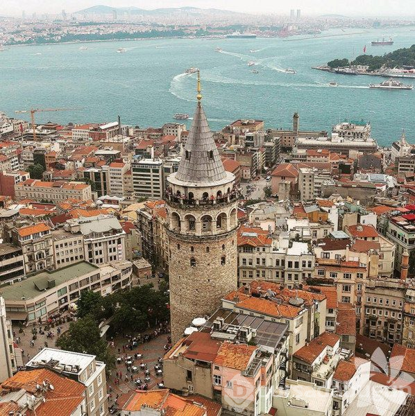
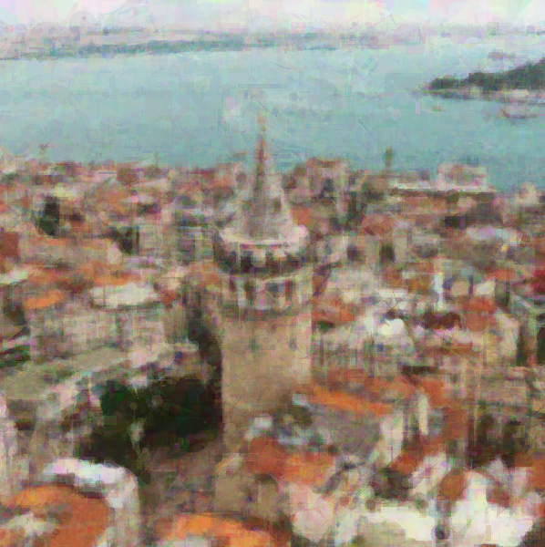

# EvoDraw: CUDA-Accelerated Evolutionary Image Reconstruction

EvoDraw is a high-performance GPU engine that reconstructs target images using geometric primitives (triangles, rectangles, circles) via **Genetic Algorithms** and **Simulated Annealing**.

<p align="center">
  
  &nbsp;&nbsp;➜&nbsp;&nbsp;
  
</p>
<p align="center"><em>Left: Reference input — Right: Reconstructed output (500,000 iterations)</em></p>

## ✨ Features

- **Full GPU Acceleration** — Written in C and CUDA for massively parallel execution.
- **Regional Undo Algorithm** — Eliminates PCIe bottlenecks by avoiding full-frame RAM-to-VRAM transfers. Calculates regional SAD (Sum of Absolute Differences) and updates only affected bounding boxes.
- **Simulated Annealing** — Dynamically scales primitive dimensions and alpha transparency over 500,000 iterations, transitioning from broad strokes to fine-grained details.
- **Safe Memory Management** — Implements clamped boundary limits to prevent illegal memory access during massive parallel executions.
- **Multi-Primitive Support** — Circles, rectangles, and triangles with alpha blending.

## 📁 Project Structure

```
evodraw-cuda/
├── src/
│   └── main.cu            # Core CUDA source code
├── include/
│   ├── stb_image.h        # Image loading (stb)
│   └── stb_image_write.h  # Image writing (stb)
├── images/
│   ├── referans.png        # Reference input image
│   └── evodraw_final.png   # Generated output
├── .gitignore
├── LICENSE
└── README.md
```

## 🔧 Requirements

- **NVIDIA GPU** (Compute Capability 6.1+ recommended, tested on MX330)
- **CUDA Toolkit** (11.0 or later)
- **MSVC** (Visual Studio C++ compiler) on Windows
- **Git** (for cloning the repository)

## 🚀 Getting Started

### Clone the Repository

```bash
git clone https://github.com/frkn-mt-tpkr/evodraw-cuda.git
cd evodraw-cuda
```

### Compile

```cmd
nvcc -arch=sm_61 -allow-unsupported-compiler -Xcompiler "/D_ALLOW_COMPILER_AND_STL_VERSION_MISMATCH" -I include src/main.cu -o evodraw_gpu
```

> **Note:** Replace `sm_61` with your GPU's compute capability. Common values: `sm_75` (Turing), `sm_86` (Ampere), `sm_89` (Ada Lovelace).

### Run

Place your reference image as `images/referans.png` and run:

```cmd
evodraw_gpu.exe
```

The output will be saved to `images/evodraw_final.png`.

## 🧬 How It Works

1. **Initialization** — The target image is loaded and transferred to GPU memory. A blank canvas is created.
2. **Shape Generation** — A random primitive (circle, rectangle, or triangle) is generated with random position, size, color, and alpha.
3. **Fitness Evaluation** — Regional SAD is calculated on the GPU using atomic operations, comparing only the affected bounding box region.
4. **Selection** — If the new shape reduces error, it's kept. Otherwise, the region is restored from the best canvas (Regional Undo).
5. **Annealing** — Over 500K iterations, shape sizes shrink and alpha decreases, moving from coarse to fine detail.

## 📄 License

This project is licensed under the [MIT License](LICENSE).